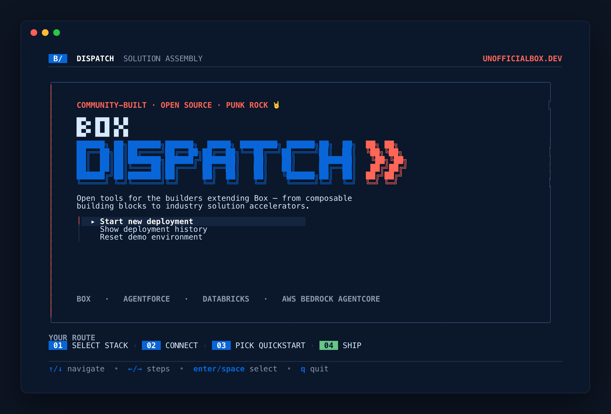
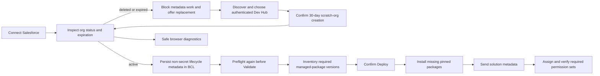

# box-dispatch

<p align="center">
  
</p>

`box-dispatch` is the CLI for **box-dispatch**, a set of building blocks and accelerators for Box-backed solution stacks (Box, Salesforce, Databricks, AWS Bedrock AgentCore).

This repo starts with a fast setup/check experience and expands toward scenario install and deployment workflows.

## Launch behavior

Running `box-dispatch` with no subcommand starts the local Go service, serves the bundled
browser workspace, and opens it in the default browser:

```bash
box-dispatch
```

This single process owns the browser UI, API, credentials, validation, deployment, and audit
state. No separate Vite or API process is required. The executable keeps running while the
browser app is open.

Use `box-dispatch terminal` when the legacy full-screen terminal interface is specifically
needed. `box-dispatch serve --no-open` serves the complete browser application without opening
a browser. Use `box-dispatch check --json` for machine-readable connectivity automation.

Use the explicit `check` command when connectivity validation is the intended operation:

```bash
box-dispatch check
box-dispatch check --offline
box-dispatch check --json
```

`box-dispatch check` uses its interactive progress UI in a TTY, `--offline` skips live
provider calls, and `--json` is suitable for scripts and redirected output.

### Interactive deployment workflow

The default shell presents one five-stage path:

1. **Choose** — select a solution quickstart and its providers together.
2. **Connect** — verify access only for those providers.
3. **Configure** — choose the destination, deployment strategy, and supported Box capabilities.
   **Reuse existing** is selected by default; switch to **Create new** when the deployment needs
   a uniquely named workspace.
4. **Review** — preview the complete plan before anything is created or changed.
5. **Deploy** — assemble the package, validate provider state and prerequisites, install required
   managed packages, deploy supported missing configuration, and verify permission assignments.

Databricks and AWS Bedrock AgentCore remain visible in **Choose** as dimmed **Coming soon** roadmap
items. They are read-only and cannot be added to the active provider plan yet.

Packaging and validation remain visible inside **Deploy**; they are not separate navigation
destinations. The active provider carries the progress animation while completed providers
collapse to one-line results. Press `v` to switch between the focused summary and full provider
checklists. Reset is available from **Deployment history**, where Dispatch shows the recorded
resources and requires explicit confirmation before removing anything.

The launch shell verifies a provider the first time it connects, then stores a credential-free
verification snapshot in `.dispatch/connection-settings.bcl`. Later shell sessions reuse that
CONNECTED state instead of repeating provider calls. **Recheck connections** always performs a
fresh check, and choosing another alias, profile, Box OAuth client, or CCG app invalidates the old
snapshot and verifies the replacement immediately. Open a connected provider and choose
**Forget saved verification** to remove only its snapshot; Dispatch keeps the configured
connection and returns that provider to NOT CHECKED.

Starting another deployment in the same shell clears the previous package, validation,
deployment, progress, and audit state. Verified provider connections remain available, but every
new deployment assembles and evaluates its own selected package.

## First-time UX (FTUX)

1. `box-dispatch check` (interactive by default)
   - discovers required platform tools
   - validates local credentials/config
   - validates live connectivity (unless `--offline`)
   - prints clear next commands for any disconnected provider
2. `box-dispatch init --source-url <git-url>`
   - pulls scenario source and copies example runtime config
3. `box-dispatch setup`
   - creates the local runtime config if it does not exist
4. `box-dispatch resolve --scenario <name>`
   - resolves token-backed provider config and writes manifests
5. `box-dispatch deploy --scenario <name> --yes` (`bootstrap` remains a compatibility alias)
   - applies provider bootstrap steps and emits state

## Interactive check experience

Run:

```bash
box-dispatch check
```

- Uses a Bubble Tea terminal UI with a branded header and live progression.
- If a provider is not connected, `box-dispatch` prints copy/paste-ready commands to connect it.
- Works in both:
  - `TTY` interactive mode (default)
  - `--json` machine output for scripts
- Can skip network calls with `--offline` while still validating required config.

Platform filters:

```bash
box-dispatch check --platform box
box-dispatch check --platform salesforce
box-dispatch check --platform databricks
box-dispatch check --platform aws
```

## Command surface

Default help keeps the normal operator path short:

- `check` - validate dependencies and connectivity
- `deploy` - apply resolved artifacts and provider configuration (`bootstrap` remains an alias)
- `status` - report unresolved environment and scenario health
- `reset` - interactively preview and reset a recorded deployment by audited resource ID

Advanced help contains the authoring, diagnostic, and presentation commands: `init`, `setup`,
`resolve`, `source`, `scenarios`, `env`, `import`, `validate`, `present`, `smoke`, and
`publish-check`. Existing command names remain available for compatibility.

`--offline` consistently means “skip live connectivity checks” on connectivity commands.
Validation uses the explicit `--skip-artifacts` flag; its former `--offline` spelling remains
as a hidden deprecated alias for existing scripts.

The staged plan for simplifying the interactive flow and default command help is tracked in
[`docs/EXECPLAN_CLI_UX_STREAMLINING.md`](docs/EXECPLAN_CLI_UX_STREAMLINING.md).

## Configuration

Runtime configuration is isolated by profile. Use either:

- `--profile <name>` on CLI commands
- `BOX_DISPATCH_PROFILE=<name>` environment variable
- or `default` profile when neither is set

Profile state is stored under:

- `~/.config/box-dispatch/<profile>/environment.json`
- `~/.config/box-dispatch/<profile>/environment.example.bcl`
- `~/.config/box-dispatch/<profile>/validation-receipts.json`
- `~/.config/box-dispatch/<profile>/bootstrap-state.json`
- `~/.config/box-dispatch/<profile>/source-state.json`

If the new profile layout is unavailable, runtime config still falls back to repository
`config/runtime/environment.example.bcl` when initializing from existing scenario
repositories for compatibility.

The interactive launch shell also keeps project-local presentation settings in
`.dispatch/ui-settings.bcl`. Its `metadata.boxComponentVisibility` map controls which Box
capability catalog rows appear on **Configure Box components**. Supported capabilities
default visible; capabilities with incomplete or missing public APIs default hidden. Making
an unsupported capability visible only shows a locked reference row—it cannot be packaged
or deployed. See [`docs/PUBLIC_API_GAPS.md`](docs/PUBLIC_API_GAPS.md) and the tracked
[`config/runtime/ui-settings.example.bcl`](config/runtime/ui-settings.example.bcl).

Press `?` or `F1` anywhere outside an active text field to open the expanded keyboard and
accessibility help. Set `metadata.accessibleForms` to `true` in `.dispatch/ui-settings.bcl` to
use Huh's screen-reader-oriented form prompts. Set the standard `NO_COLOR` environment variable
or pass `--no-color` to disable ANSI colors. `TERM=dumb` also disables color and selects the
plain, non-full-screen command output.

### Salesforce org lifecycle safety

The launch shell treats Salesforce org health as part of connectivity. It inspects the selected
org on the first **Connect** check, when the operator selects or rechecks an org, immediately
before **Validate**, and immediately before **Deploy**. A saved verification snapshot avoids
repeating the initial Connect call; its recorded expiration/status is still rejected locally when
stale, and the live deployment guards reject a deleted, expired, or otherwise inactive scratch org
before any metadata request is sent.

**Connect > Salesforce** presents only the next useful choices: continue with the connected
org, use an existing Salesforce org, or create/replace a 30-day scratch org. Choosing a local
Salesforce CLI profile validates it immediately; the same screen can open Salesforce login
for a new profile. Press `r` to recheck the current org without adding another menu action.

The browser workspace does not require that CLI flow. Its Salesforce environment drawer sends
target-org and Dev Hub credentials only to the loopback Go service, which checks availability
through Salesforce REST and can create, poll, authorize, save, and select a replacement scratch
org. Secrets are never returned in browser API responses. With REST credentials saved, Go uses
Salesforce REST for org and permission operations, Tooling API for managed-package inventory and
installation, and Metadata API for source inventory and deployment. The browser receives safe
per-component progress and sanitized provider diagnostics; it does not require Salesforce CLI.

The Box connection drawer follows the same local-service boundary. Saving new Client Credentials
Grant settings first mints a token and checks the acting Box user; only credentials accepted by Box
are persisted as active. A previously saved, unverified connection can be rechecked directly from
the drawer. The browser receives only the alias, verification state, authentication type, and
masked identifiers.

The terminal flow discovers authenticated Dev Hubs and passes the selected alias explicitly to
Salesforce CLI, so a CLI-wide default is not required. The browser flow instead uses the Dev Hub
REST credential saved in the owner-only `.dispatch/connection-settings.bcl` store. Creation is
confirmation-gated; the generated alias, org ID, org type, status, expiration date, instance URL,
and target access token remain in that local Go-owned store and are never returned to browser code.
Scratch-org creation itself remains provider-neutral. During solution validation, Dispatch
checks the managed-package versions declared in `dispatch.bcl` and shows missing packages as
explicit deployment prerequisites. After the operator confirms **Deploy**, Dispatch installs
or upgrades each pinned `04t` package version non-interactively before sending solution
metadata. Dispatch sends only the metadata components validation found missing; it does not
resend existing org metadata merely to finish prerequisites or permission-set assignments.
For source-tracked orgs, validation previews the missing selectors and treats conflicts as
existing tenant configuration rather than silently overwriting them.
The bundled CLM contract requires Box for Salesforce 5.43.0.1
(`04tKi000000gPNZIA2`) with admin-only access. The same contract declares the five
required Box and CLM permission sets. Validation checks their assignment on the
authenticated **System Administrator**; after metadata deployment makes local permission
sets available, Dispatch assigns only the missing sets and verifies the result. Existing
manual assignments are reported as present and are not recreated.

After a deployment, press `b` to open the Box Admin Console for the connected enterprise.
When the selected Salesforce target is a scratch org, press `s` to open it through Salesforce
CLI. The Box browser session determines the enterprise shown; Dispatch includes the connected
EID in the action label so the operator can confirm the target. The completion screen defaults to
created, existing, and failed counts; press `v` to inspect the deployed-resource table and full
credential-free audit path.

Normal failures show a concise remediation message. The browser diagnostic drawer includes the
provider, error code, recommended next steps, and sanitized technical detail. The terminal fallback
offers the equivalent detail with `d`; token-, secret-, password-, session-, query-, and local-path
values are redacted.



Generated solution packages use BCL for their complete package contract:

- `dispatch.bcl` — template, workspace, sample-content, capability, managed-package and
  permission-set prerequisites, and deployment-order definition
- `.dispatch/deployment.bcl` — component selection, naming strategy, and rollback settings

New deployment settings default to `reuse`, so matching resources are reused rather than copied
under a run-specific name. Select `create_new` explicitly when isolation is required.

JSON solution manifests and deployment settings are unsupported. An invalid `dispatch.bcl`
fails explicitly, and `deployment_config` must reference a package-relative `.bcl` file.
Packaging removes obsolete `dispatch.json` and `.dispatch/deployment.json` files if they are
encountered in a cloned template. See
[`BCL_ARTIFACT_CONTRACT.md`](BCL_ARTIFACT_CONTRACT.md#2-solution-configuration-contract).

The checker looks for:

- **Box**: a CCG app configured in Dispatch, or `BOX_CLIENT_ID`, `BOX_CLIENT_SECRET`, and `BOX_REFRESH_TOKEN`
- **Salesforce**: `SF_ALIAS` (or `SALESFORCE_ACCESS_TOKEN`)
- **Databricks**: `DATABRICKS_HOST`, `DATABRICKS_TOKEN`
- **AWS**: `AWS_PROFILE`, `AWS_REGION`/`AWS_DEFAULT_REGION`

For cleanup-safe teardown, Box Dispatch also captures deployment IDs when present:

- **Box**: `BOX_FOLDER_ID`, `BOX_ENTERPRISE_ID`
- **Salesforce**: `SF_ORG_ID` (optional)

When provided, these IDs are written to `<provider>-artifacts.bcl` as the single emitted artifact bundle for import and cleanup.
- `<provider>-artifacts.bcl` is Box Configuration Language in Terraform-like syntax.
- It includes Box Dispatch-specific extension metadata under `locals` (`bcl.ext.box`) so cleanup tooling can stay provider-aware without extra convention guessing.
Files are emitted during both `resolve` and `bootstrap` so they can feed cleanup tooling.

## Standardized import

See the artifact contract for full import/export rules: [BCL_ARTIFACT_CONTRACT.md](BCL_ARTIFACT_CONTRACT.md)

Use `box-dispatch import` as the single admin-facing entry point for loading deployment details:

```bash
box-dispatch import <path>
```

- Supported standard inputs:
  - `<path>.bcl` (Box Configuration Language with `locals.bcl` metadata)
  - `<path>/*-artifacts.bcl` (directory import)
Examples:

```bash
box-dispatch import ./generated/box-artifacts.bcl
box-dispatch import ./generated --force
```

## Development

```bash
go run ./cmd/box-dispatch check
go run ./cmd/box-dispatch check --json
go run ./cmd/box-dispatch check --platform aws --offline
go run ./cmd/box-dispatch init --source-url <git-url>
go run ./cmd/box-dispatch setup
go run ./cmd/box-dispatch resolve --scenario <name> --dry-run
go run ./cmd/box-dispatch deploy --scenario <name> --yes
```
