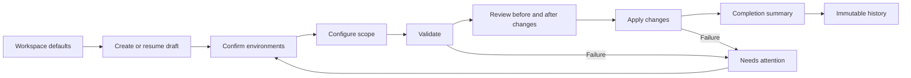

# Product design best practices for operational web applications

This guide captures the reusable product, interaction, and visual design practices
developed while building a local-first deployment application. It is intended as a
starting point for new dashboards, administration tools, deployment consoles, and
other workflow-heavy products.

The examples use providers and deployments because they make the decisions concrete,
but the principles apply to any system that connects environments, validates changes,
runs long-lived work, and preserves an audit trail.

## 1. Start with the operator's mental model

Organize the product around the questions an operator is trying to answer:

1. What needs my attention now?
2. Which environments am I operating against?
3. What will change if I continue?
4. What is happening right now?
5. What changed, and where can I verify it afterward?

Do not organize the interface around internal services, API boundaries, database
tables, or implementation phases unless those concepts are also meaningful to the
operator.

### Separate three kinds of state

Treat these as different product concepts and different data models:

| State | Meaning | Where it belongs |
| --- | --- | --- |
| Workspace defaults | Starting choices for future work | Settings |
| Active work | A draft, running operation, or failed operation that can be resumed | Overview and workflow |
| Completed work | An immutable result that can be reviewed but not resumed | History |

A completed operation must not continue to appear as active or resumable. It may be
the latest result, but it is no longer work in progress.

### Use an explicit lifecycle

Model the workflow before designing individual screens. A useful deployment-style
lifecycle is:

The UI should make state transitions explicit. Avoid vague primary actions such as
“Continue” when a more specific label like “Review plan,” “Validate deployment,” or
“Start deployment” is available.

## 2. Give each page one primary responsibility

### Overview

Use Overview to answer “what should I do next?”

- Show active or resumable work first.
- When nothing is active, state that clearly and offer a new-work action.
- Show a small set of operational metrics, not a full analytics dashboard.
- Show selected environment summaries so the operator can confirm context quickly.
- Show a short recent-history list with links to immutable records.
- Do not duplicate the full workflow, connection manager, or history browser.

### Workflow

Use a linear workflow for tasks with meaningful prerequisites.

- Prefer explicit Back and Next-style actions.
- Allow completed and current stages to be revisited.
- Do not let future stages appear available before prerequisites are satisfied.
- Keep the primary action stable and predictable within each stage.
- Preserve the draft across reloads when work is expected to take more than a moment.
- Restore long-running or failed work to the stage where the operator can act.

### Settings

Use Settings for durable workspace configuration.

- Keep global defaults separate from an individual draft.
- Let a new draft inherit defaults, but allow the draft to override them.
- List every saved connection, not only the selected connection.
- Make selection, readiness, removal, and management distinct operations.
- Avoid showing transient deployment progress in Settings.

### History

Use History for immutable audit records.

- Make each recent-history entry link directly to its detailed record.
- Provide filters only for fields operators actually recognize and use.
- Preserve deployment name, systems, strategy, timing, result, and environment context.
- Show individual components or resources changed by the operation.
- Keep historical records read-only.
- Put destination actions and change review in the historical record, not in a hidden menu.

## 3. Attach actions to the object they affect

Placement communicates scope. Put an action in the header of the card, section, row,
or dialog it controls.

- Put “Open Box” in the Box summary header.
- Put “Open Salesforce” in the Salesforce summary header.
- Put “Review changes” near the change summary.
- Put “Manage” in the connection-panel header.
- Put row removal actions on the connection row being removed.

Avoid a shared toolbar containing actions for several unrelated cards. It forces the
operator to map each button back to an object and becomes difficult to scan as more
systems are added.

### Keep action labels concise

Button text should describe the action and destination, not repeat every identifier.

| Prefer | Avoid |
| --- | --- |
| Open Box | Open Box EID 5105484 |
| Open Salesforce | Open Salesforce org 00D... |
| Review changes | View the validated deployment metadata differences |
| Manage | Configure the selected provider connection |

Keep technical identifiers in the supporting details where they can be copied and
audited without making the primary action noisy.

### Use hierarchy deliberately

- One clear primary action per decision point.
- Neutral buttons for secondary navigation and destination links.
- Destructive actions must be visually and spatially distinct.
- Icon-only buttons require an accessible label and a familiar icon.
- Do not nest interactive controls inside other buttons or links.

## 4. Make environment identity recognizable

An alias alone is often ambiguous, while an opaque ID alone is hard to recognize.
Present a layered identity:

1. Human-readable alias or environment name.
2. Recognizable tenant hostname or subdomain.
3. User identity when it clarifies who is acting.
4. Environment type, such as production, sandbox, scratch org, or user account.
5. Technical ID as supporting audit detail.
6. Readiness or verification state.

For example, a Salesforce connection is easier to recognize by its My Domain than by
its organization ID. A Box enterprise is easier to recognize by its custom
`*.app.box.com` hostname than by its enterprise ID.

### Support multiple saved environments

- Model saved environments as a list, not a single global credential.
- Give each connection a stable identifier and an editable alias.
- Make the selected environment unmistakable.
- Show selected and readiness as separate states.
- Keep non-selected environments visible in Settings and management drawers.
- Preserve a failed connection so it can be reconnected; do not silently discard it.

### Sanitize browser-facing identity

The browser should receive only what is needed for recognition and interaction.

- Return hostnames rather than full provider URLs when the path is not meaningful.
- Strip user information, ports, paths, fragments, and query strings from display hosts.
- Never return access tokens, refresh tokens, client secrets, authorization codes, or
  raw provider responses.
- Use server-owned launch endpoints when opening a destination requires refreshed or
  provider-specific authentication.
- Treat every browser-visible error and audit value as potentially shareable.

## 5. Distinguish status, progress, and outcome

These concepts answer different questions:

| Concept | Question | Recommended treatment |
| --- | --- | --- |
| Readiness | Can this environment be used? | Compact status badge |
| Progress | How far has active work advanced? | Progress bar, stepper, or live trace |
| Outcome | What was the final result? | Complete, needs attention, or recorded badge |

Do not use color alone to communicate state. Pair color with a label and, when useful,
an icon or supporting sentence.

Use the design system's status glyph family for execution and outcome states. Do not
draw checkmarks, warnings, or failures with text characters or CSS-generated content.
Keep the specific outcome words visible beside or immediately after the glyph.

### Keep badges scarce

Badges are strongest when they answer a single status question. Avoid turning metadata
such as counts, IDs, dates, or ordinary categories into badges.

### Design failure as a resumable state

- State what failed in plain language.
- Preserve successful prior steps.
- Provide the next safe action.
- Keep technical details available but secondary.
- Restore failure state after reload.
- Never present failed work as complete merely because the process stopped.

## 6. Show changes before and after execution

For configuration or deployment tools, “validation passed” is not enough. Operators
need evidence of what will change.

### Reuse one immutable comparison snapshot

Capture a bounded, credential-free change snapshot during validation and reuse the same
evidence in three places:

1. After validation, before the operator authorizes deployment.
2. On the completion summary, after deployment.
3. In immutable history for later review.

This prevents the pre-deployment preview and historical record from telling different
stories.

### Use a familiar diff model

- Use a Git-like split or unified before/after view.
- Label both sides in domain language, such as “Current org” and “Validated package.”
- Show one file or component at a time when the content is large.
- Provide a visible file list and changed-file count.
- Distinguish additions from updates.
- Exclude unchanged files, binary contents, credentials, and unbounded payloads.
- Show “Change preview not recorded” for legacy records rather than implying no change.

Only show “Review changes” when a real preview exists. Do not render an enabled action
that opens an empty diff.

## 7. Build useful completion and history summaries

A completion summary should answer:

- Did every selected system finish successfully?
- What was deployed versus already present?
- Is anything remaining or manual?
- Which individual components changed?
- Which environments received the changes?
- Where can I open the result?
- Where can I review the before/after evidence?

Use one provider summary card per system. A strong card contains:

- Provider name.
- Provider-scoped Open action in the header.
- Final outcome badge.
- Deployed, present, remaining, and manual counts.
- Optional environment identity when it improves auditability.

Follow the provider cards with a component table containing system, component, and
result. Keep the high-level result scannable before presenting the detailed inventory.

## 8. Use a restrained visual system

Operational interfaces benefit from calm, predictable visual hierarchy.

### Page hierarchy

Use a consistent sequence:

1. Eyebrow for section context.
2. One page title.
3. One sentence of supporting copy.
4. A divider or deliberate spacing break.
5. Cards, tables, or details rails grouped by task.

### Cards

- Use cards for bounded objects or environments, not for every paragraph.
- Keep borders light and backgrounds neutral.
- Reserve tinted backgrounds for intentional selection, warning, or focus states.
- Use the card header for identity, actions, and outcome.
- Align repeated metrics consistently across cards.

### Color

- Define color by semantic role, then register those values with the component
  library's theme system so product CSS and shared components stay aligned.
- Use the brand color for navigation, links, primary actions, focus, and selection.
- Show active navigation with a restrained background plus text and icon contrast.
  Avoid decorative left-edge accent bars that compete with the item content.
- When the brand color is also green, pair positive states with explicit labels and
  keep their treatment distinct from primary actions.
- Reserve a secondary accent for small contextual signals such as eyebrows,
  informational badges, and recorded-state labels; do not let it compete with the
  primary action.
- Use red for errors and destructive actions.
- Use neutral grays and soft rules for structure.
- Verify contrast in every interactive and disabled state.

Dispatch uses near-black neutral surfaces with a four-color semantic palette:

- mint `#00e581` for primary actions and selection;
- orange `#ffa300` for pending and contextual states;
- purple `#8b49cf` for recorded and audit states; and
- blue `#0098ff` for informational states.

The supplied colors are registered directly as design-system tokens. Light surfaces
use contrast-safe companions such as mint `#007a4c`, orange `#7a4a00`, and blue
`#0068ad` when the same hue renders small text or a control boundary. This preserves
the intended palette without sacrificing readability on white.

### Theme preferences

- Follow the operating-system color preference by default; add an explicit user
  choice only when the product needs to override it.
- Start the theme controller before rendering the application so the shell and
  design-system components resolve to the same theme.
- Map application-specific semantic roles such as page surface, muted text, rule,
  and selected surface to design-system tokens. Do not maintain a second hard-coded
  light and dark palette.
- Keep brand navigation visually stable across themes while checking the contrast of
  active, hover, focus, disabled, success, and error states independently.
- Exercise the complete workflow in one theme and the primary pages in both themes;
  a dark landing-page screenshot alone does not prove dark-mode support.

### Typography and copy

- Use sentence case for headings, buttons, and field labels.
- Keep supporting copy short and operational.
- Prefer recognizable product language over internal jargon.
- Use monospaced text selectively for immutable IDs or code-like values.
- Let long hostnames and component names wrap safely without causing page overflow.

## 9. Reuse the design system before creating primitives

Prefer an established component library for buttons, badges, drawers, tables, switches,
progress indicators, steppers, diff viewers, and notifications.

- Compose library primitives into product patterns.
- Do not create a parallel custom component when an accessible primitive already exists.
- Document genuine component gaps instead of hiding them behind one-off CSS.
- Wrap framework-agnostic components carefully and forward their native events.
- Keep product-specific layout in the application and reusable behavior in the design
  system.

### Retire obsolete styles with the component they served

- Remove selectors for the replaced host markup in the same change that adopts a
  design-system primitive.
- Style Web Components through documented host properties, attributes, and public
  parts; do not retain selectors for inaccessible shadow markup.
- Before deleting a selector, confirm that its exact class is absent from static,
  conditional, and generated class names.
- Consolidate repeated live declarations only when the selector, property,
  importance, and responsive or at-rule context are identical. Preserve the final
  declaration in cascade order as the authoritative value.
- Re-run interaction tests plus desktop and narrow visual checks after cleanup. A
  successful CSS build alone does not prove that a fallback or responsive state was
  preserved.

## 10. Design responsive behavior intentionally

Do not treat mobile as the desktop layout at a smaller width.

### Responsive rules

- Collapse multi-column dashboards into one readable column.
- Stack metrics while preserving their label/value hierarchy.
- Let provider-card header actions wrap without separating them from the provider.
- Convert four-column provider metrics into a two-by-two grid on narrow screens.
- Stack form controls and footer actions when horizontal space is limited.
- Give dense tables an explicit horizontal-scroll container rather than overflowing the
  document.
- Keep drawers and dialogs usable within the viewport.
- Preserve touch-friendly target sizes and spacing.

Test at least one realistic narrow viewport, such as `390 x 844`, in addition to a
desktop viewport. Zero document-level horizontal overflow is the acceptance criterion;
intentional scrolling inside a table or diff region is allowed.

## 11. Accessibility is part of the component contract

- Use semantic landmarks, headings, lists, tables, and definition lists.
- Maintain one logical heading hierarchy per page.
- Give tables captions, even when visually hidden.
- Use real buttons for actions and links for navigation.
- Give icon-only controls an accessible name.
- Associate every field with a visible label.
- Expose selected, pressed, expanded, busy, and disabled states programmatically.
- Use live regions for asynchronous status when the update matters immediately.
- Keep focus visible and return focus predictably when a drawer or dialog closes.
- Ensure keyboard access for every workflow stage and management action.
- Avoid nested interactive elements.

Accessibility behavior should be covered by component and browser tests, not only by a
visual review.

## 12. Make loading, empty, unavailable, and error states explicit

Every data-driven region should define these states before implementation:

- Loading: use skeletons or concise busy messaging without shifting the entire layout.
- Empty: explain what will appear and provide the next relevant action.
- Unavailable: explain that evidence was not recorded or cannot be retrieved.
- Error: state the failure, preserve safe context, and offer a recovery action.
- Stale: show when a connection must be reverified instead of presenting old readiness.

Avoid blank cards, silent failures, disabled controls without explanation, and generic
messages such as “Something went wrong” when a safe actionable message is available.

## 13. Keep browser presentation separate from privileged execution

The user experience and security model should reinforce each other.

- The browser owns navigation, forms, temporary state, and presentation.
- A trusted local or server-side service owns credentials, provider calls, package
  assembly, validation, deployment, and audit persistence.
- Browser APIs return purpose-built presentation models rather than raw provider models.
- Long-running work exposes sanitized progress events.
- Immutable history stores safe IDs, counts, names, timing, and bounded change previews.
- Launch actions validate destinations and use secure URLs or trusted local endpoints.

This boundary makes the interface easier to reason about and prevents convenience UI
from becoming a credential leak.

## 14. Validate the rendered experience, not only the build

A successful build proves that code compiled. It does not prove that the interface is
usable.

### Minimum verification loop

1. Run the narrowest unit or component tests for changed behavior.
2. Run frontend lint, the complete frontend test suite, and a production build.
3. Run backend format, build, vet, and tests when browser models or APIs changed.
4. Run the primary end-to-end workflow against deterministic mock state.
5. Rebuild and restart the embedded application.
6. Refresh the served page and test the exact user flow.
7. Check desktop and narrow mobile layouts.
8. Inspect browser warnings and errors.
9. Capture screenshot evidence.
10. Confirm no unexpected document-level horizontal overflow.

### Distinguish different kinds of proof

Report these independently:

- Code changed.
- Unit tests passed.
- Production build passed.
- Browser workflow passed.
- Live provider or tenant behavior passed.
- Commit created.
- Branch pushed.
- Pull request merged.

Do not let one kind of evidence stand in for another.

## 15. New-project starter checklist

### Product model

- [ ] Define defaults, active work, completed work, and failure/resume semantics.
- [ ] Write the primary workflow as an explicit state diagram.
- [ ] Decide what becomes immutable history.
- [ ] Define what operators must see before authorizing a change.

### Information architecture

- [ ] Give Overview, workflow, Settings, and History distinct responsibilities.
- [ ] Link recent items directly to detailed historical records.
- [ ] Keep global defaults separate from per-operation overrides.
- [ ] Keep completed work out of active/resumable areas.

### Connections and environments

- [ ] Support multiple saved environments where users realistically have them.
- [ ] Show alias, recognizable hostname, identity, type, technical ID, and readiness in
      descending order of prominence.
- [ ] Make selected and ready separate states.
- [ ] Define reconnect, select, remove, and open as distinct actions.
- [ ] Sanitize every browser-facing connection field.

### Actions and components

- [ ] Attach actions to the card, row, or section they affect.
- [ ] Use short action labels and keep IDs in supporting details.
- [ ] Reuse the design system before creating custom primitives.
- [ ] Provide accessible names for icon-only controls.
- [ ] Avoid nested interactive elements.

### Change review and audit

- [ ] Capture a bounded before/after snapshot during validation.
- [ ] Reuse the same snapshot before deployment, after deployment, and in history.
- [ ] Clearly distinguish additions, updates, unchanged content, and missing legacy data.
- [ ] Show provider summaries before detailed component inventories.
- [ ] Preserve destination actions in completion and history views.

### Responsive and accessible behavior

- [ ] Test desktop and at least one `390px`-class viewport.
- [ ] Test the primary pages in light and dark system preferences.
- [ ] Confirm a live system-preference change updates without reloading.
- [ ] Confirm zero document-level horizontal overflow.
- [ ] Verify heading order, landmarks, table captions, focus, and keyboard behavior.
- [ ] Test loading, empty, error, unavailable, and stale states.
- [ ] Confirm status is never communicated by color alone.

### Delivery evidence

- [ ] Unit and component tests pass.
- [ ] Lint and production build pass.
- [ ] Backend checks pass when contracts changed.
- [ ] End-to-end workflow passes.
- [ ] Served browser flow passes after refresh.
- [ ] Console is free of relevant warnings and errors.
- [ ] Desktop and mobile screenshots are reviewed.
- [ ] Commit, push, pull request, and merge status are reported separately.

## 16. Common anti-patterns

- Showing a completed operation as active because its draft still exists.
- Using opaque IDs as the primary connection identity.
- Putting provider-specific actions in one unrelated global toolbar.
- Repeating EIDs, org IDs, or long hostnames in button labels.
- Showing “validated” without showing what will change.
- Recomputing a different diff after deployment instead of preserving reviewed evidence.
- Treating “no recorded preview” as “no changes.”
- Hiding all saved connections except the selected one.
- Mixing workspace defaults with deployment-specific readiness and names.
- Using decorative green backgrounds for ordinary ready states.
- Adding custom controls when the design system already has an accessible primitive.
- Claiming completion from a passing build without browser verification.
- Treating mock success as live-provider proof.

## 17. Definition of done for a workflow UI

A workflow feature is complete when:

- The state model is correct across reloads and failure paths.
- The operator can identify the selected environment quickly.
- Primary and secondary actions are attached to the correct object.
- The operator can see what will change before authorizing it.
- Completion and history preserve the same evidence.
- Empty, loading, error, unavailable, and stale states are understandable.
- The interface is keyboard accessible and responsive without document overflow.
- Automated tests and served-browser QA both pass.
- Delivery status is reported accurately and separately from implementation status.
