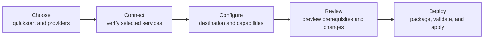

# CLI UX Streamlining ExecPlan

## Objective

Make Box Dispatch feel smaller without removing its provider, packaging, validation, deployment,
or diagnostic capabilities. The normal path should present one decision at a time; advanced
commands and full diagnostics remain available on demand.

## Current evidence

Before this plan, the product exposed three competing workflow models:

- the launch shell uses `BUILD -> CONNECT -> TEMPLATE -> CONFIG -> PACKAGE -> VALIDATE -> DEPLOY`;
- the welcome screen summarizes a different four-part route;
- the README onboarding asks users to run five separate setup commands.

The root command also exposes more than a dozen task commands at the same level. Inside the shell,
several screens repeat key bindings in both the content area and footer, connection rows show every
discovered identifier, and navigation position is presented as percentage progress.

## Target interaction model

Packaging and validation remain explicit in the deployment checklist, but they do not require
separate navigation destinations for the default interactive path.

## Interaction rules

- Present one primary action per screen.
- Keep provider rows to status plus essential identity; expose IDs, hosts, and diagnostics in the
  provider detail screen.
- Keep keyboard guidance in one contextual footer. Do not repeat it inside panels.
- Show percentage progress only for active work with measurable completion. Use the step rail for
  navigation position.
- Follow live validation and deployment output until the operator scrolls upward. Stop at list
  boundaries and resume tailing when the operator returns to the bottom.
- Default errors to what failed, why, and the next action. Keep sanitized raw diagnostics behind
  `d`.
- Keep destructive reset out of the default Start path and require preview plus confirmation.
- At 80x24, prioritize one title, one short explanation, one primary panel, and one footer.

## Delivery slices

### Slice 1: visual and copy decluttering

Status: completed on 2026-08-11.

- Remove artificial overall-progress percentages and their animation loop.
- Remove implementation-library names from customer-facing copy.
- Reduce connection rows to essential identity while preserving full provider details.
- Compact secondary Connect actions.
- Remove duplicated in-panel keyboard instructions.

This slice must not change provider checks, state transitions, package generation, validation, or
deployment behavior.

### Slice 2: command discoverability

Status: completed on 2026-08-11.

- Make `deploy`, `check`, `status`, and `reset` the Common commands in default help.
- Group authoring, diagnostics, and presentation commands under Advanced help.
- Keep existing command names and aliases for compatibility.
- Normalize shared flags and remove conflicting meanings such as command-specific interpretations
  of `--offline`.

### Slice 3: five-stage shell

Status: completed on 2026-08-11.

- Combine provider and template selection into Choose.
- Combine package configuration and the deployment preview into Configure and Review.
- Run package, validation, managed-package prerequisites, and provider deployment from one Deploy
  screen.
- Replace the welcome route and seven-stage rail with the same five-stage vocabulary.
- Move Reset into deployment history/details rather than the default home menu.

The default shell now follows `Choose -> Connect -> Configure -> Review -> Deploy`. Package
assembly, provider validation, managed-package prerequisites, provider deployment, and permission
verification run as one confirmation-gated Deploy pipeline. The underlying operations remain
separately visible so failures retain a precise phase and diagnostic.

### Slice 4: accessibility and terminal resilience

Status: completed on 2026-08-11.

- Add a discoverable expanded help view.
- Honor `NO_COLOR`, `TERM=dumb`, and an explicit no-color option.
- Enable an accessible form mode through configuration.
- Add 80x24, 100x30, and 120x40 rendering tests plus boundary tests for every scrollable view.

Expanded help is available from `?` or `F1`; presentation settings can enable screen-reader form
prompts; standard and explicit no-color controls are honored; and `TERM=dumb` avoids the
full-screen renderer. The welcome, help, validation, and deployment views are covered at all three
supported terminal sizes. Help, diagnostics, lifecycle checklists, teardown resources, and
deployed assets clamp at both ends rather than wrapping.

## Acceptance criteria

- No customer-facing screen names implementation libraries.
- Navigation position is never described as percentage completion.
- The Connect screen shows no more than two identity lines per provider.
- A key binding appears in one place on a screen.
- Existing focused shell tests and the repository Go verification gate pass.
- Later slices preserve non-interactive and JSON behavior.

## References

- [Command Line Interface Guidelines](https://clig.dev/)
- [Cobra command organization](https://cobra.dev/docs/how-to-guides/working-with-commands/)
- [Charm Bubbles](https://github.com/charmbracelet/bubbles)
- [Charm Huh](https://github.com/charmbracelet/huh)
