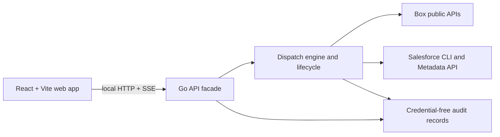

# Dispatch web application

Dispatch currently joins its Bubble Tea user interface and Go execution logic in one
process. The web application must not recreate that provider logic in the browser.

The target is a local-first browser application. React owns presentation and temporary
form state; Go remains the sole authority for credentials, provider requests, package
assembly, validation, deployment, and audited teardown.



## First vertical slice

- `web/` is a React 19 + Vite + TypeScript application using the published
  `@unofficialbox/box-open-elements` Web Components.
- The browser starts a new deployment by choosing a configured quickstart and supported
  provider set. Go resolves the template source, builds the package, and saves the
  resulting BCL plan before the browser enters review, validation, and deployment.
  It also exposes an activity rail and audit history, falling back to non-sensitive
  demonstration state while the local API facade is unavailable.
- The Vite dev server proxies `/api` to `127.0.0.1:8787`; no token or client secret is
  available to browser code.

## Current local API

Run the local API on the loopback interface:

```bash
go run ./cmd/box-dispatch serve
```

It is intentionally bound to `127.0.0.1:8787`. The API can read local state and
save a non-secret BCL plan draft, but it is not an alternate deployment client:

| Endpoint | Purpose | Deliberately excluded |
| --- | --- | --- |
| `GET /api/health` | active profile and server time | environment values |
| `GET /api/connections` | sanitized configured and verified connection state | tokens, CCG secret, client ID, provider identity, host names |
| `GET /api/connections/salesforce/options` | currently authenticated, aliased Salesforce orgs that are healthy enough to select | usernames, org IDs, instance URLs, credentials |
| `PUT /api/connections/salesforce` | select one authenticated Salesforce alias and require it to be revalidated | arbitrary targets, raw CLI output, credentials |
| `GET /api/deployments` | durable deployment-run summaries | package path, artifact hashes, raw provider output |
| `GET /api/deployments/{id}` | a run's safe component counts | diagnostics, resources, source paths |
| `GET /api/plan` | saved BCL plan and selected-provider readiness | package path, credentials, provider identity |
| `PUT /api/plan` | save a supported template/provider draft to BCL | package path and all deployment execution |
| `GET /api/templates` | BCL-configured solution quickstarts and safe display copy | repository source URLs, local paths, credentials |
| `POST /api/packages` | assemble an allowlisted template into a server-chosen local workspace, then save its BCL plan | arbitrary repositories or destinations, package path, raw Git output |
| `GET /api/runs` | recent browser-run summaries, persisted across local API restarts | package paths, raw diagnostics, provider output |
| `POST /api/runs` | start a live validation run for the assembled package | raw diagnostics and provider credentials |
| `GET /api/runs/{id}` | read a validation or deployment run summary | raw provider detail |
| `GET /api/runs/{id}/diagnostics` | safe, actionable failure guidance | raw CLI output, stack traces, credentials |
| `GET /api/runs/{id}/events` | follow safe activity updates over SSE | raw CLI output and stack traces |
| `POST /api/runs/{id}/deploy` | explicitly apply a completed validation run | implicit or unvalidated deployment |

Browser run history is saved under the operator's local Dispatch configuration
directory with owner-only permissions. A restarted server preserves terminal
history; any interrupted live run is explicitly marked as needing attention.
Every response is `Cache-Control: no-store`. The server has no cross-origin
policy and must remain loopback-only. The plan writer accepts only Box and
Salesforce selections; future providers remain unavailable until Dispatch can
execute their public lifecycle safely.

The browser can change only a Salesforce alias that the local Salesforce CLI
already knows and reports as connected. Choosing an alias clears its prior
verification snapshot, so the next validation performs the full org-health
check. Box CCG credentials remain terminal-managed and are never browser input.

Template assembly is also browser-safe by construction: the request carries a
template ID plus Box/Salesforce selections only. The local service looks up the
configured scenario, selects its repository, and creates an ignored workspace
under `.box-dispatch/web-packages/`; its absolute location and raw clone output
never cross the browser boundary.

## API progression

1. Lifecycle API: audited deployment reset by recorded resource ID, with an explicit
   confirmation endpoint.

The old terminal shell can remain as an operator fallback during this migration. Both
surfaces must call the same Go services and share the same BCL contracts.
