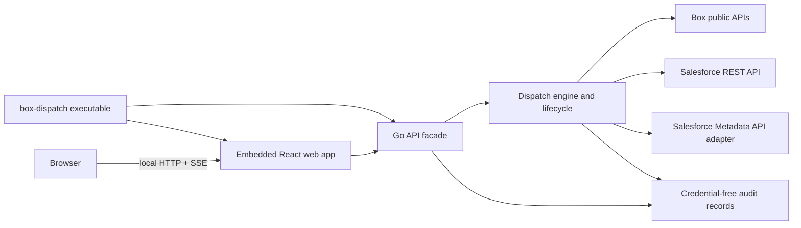
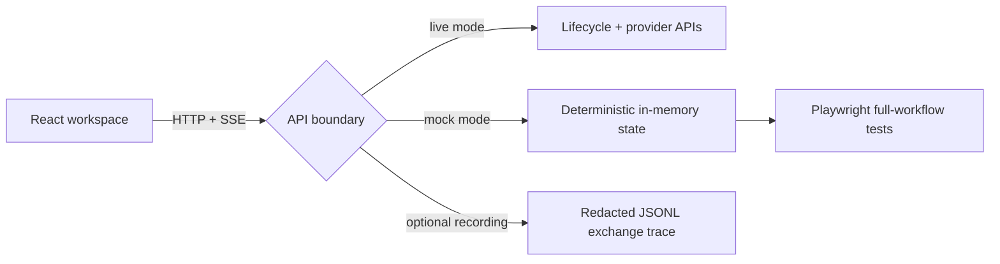

# Dispatch web application

Dispatch joins its embedded React interface and Go execution logic in one process.
The web application must not recreate provider logic in the browser.

The target is a local-first browser application. React owns presentation and temporary
form state; Go remains the sole authority for credentials, provider requests, package
assembly, validation, deployment, and audited teardown.



Frontend development has a provider-independent path that preserves the same
browser contract:



`box-dispatch mock` serves the embedded UI with in-memory connections, package
assembly, validation, deployment, deployment history, and server-sent progress
events. It never reads credentials or calls a provider. The live executable's
optional `--record-api` middleware captures the same browser-facing contract;
it redacts credential-shaped JSON fields and omits callback query strings.

## First vertical slice

- `web/` is a React 19 + Vite + TypeScript application using the published
  `@unofficialbox/box-open-elements` Web Components.
- The browser starts a new deployment by choosing a configured quickstart and supported
  provider set. Go resolves the template source, builds the package, and saves the
  resulting BCL plan before the browser enters review, validation, and deployment.
  It also exposes an activity rail and audit history, falling back to non-sensitive
  demonstration state while the local API facade is unavailable.
- The normal executable serves the compiled React application and `/api` from one loopback
  process, then opens the browser. Vite proxies `/api` to `127.0.0.1:8787` only during
  frontend development; no token or client secret is available to browser code.

## Current local API

Run the complete browser application and local API on the loopback interface:

```bash
go run ./cmd/box-dispatch
```

It is intentionally bound to `127.0.0.1:8787` and opens the app in the default browser. The API owns local state,
credentials, package assembly, validation, and deployment; the browser is a
credential-free presentation client:

| Endpoint | Purpose | Deliberately excluded |
| --- | --- | --- |
| `GET /api/health` | active profile and server time | environment values |
| `GET /api/connections` | sanitized configured and verified connection state | tokens, CCG secret, client ID, provider identity, host names |
| `GET /api/connections/salesforce/options` | safe summary of the selected REST-connected Salesforce org, with legacy CLI aliases during migration | usernames, org IDs, instance URLs, credentials |
| `PUT /api/connections/salesforce` | select one authenticated legacy Salesforce alias and require it to be revalidated | arbitrary targets, raw provider output, credentials |
| `PUT /api/connections/salesforce/rest` | save a target-org and/or Dev Hub REST connection in the owner-only local connection store | tokens, client secret, or raw credentials in the response |
| `POST /api/connections/salesforce/check` | verify that the selected Salesforce org is reachable with `/services/oauth2/userinfo` | access tokens and raw provider output |
| `POST /api/salesforce/scratch-orgs` | ask the configured Dev Hub to create a 30-day Developer scratch org | Dev Hub credentials and scratch-org access tokens |
| `GET /api/salesforce/scratch-orgs/{id}` | poll sanitized provisioning status until the new org is active or failed | authorization codes, tokens, and raw provider responses |
| `PUT /api/connections/box` | verify a new Box CCG connection against the acting-user API, then save it as active | CCG secret and all raw credential values |
| `POST /api/connections/box/check` | recheck an existing saved Box CCG connection and refresh its verification snapshot | CCG secret, access token, and provider identity |
| `GET /api/deployments` | durable deployment-run summaries | package path, artifact hashes, raw provider output |
| `GET /api/deployments/{id}` | a run's safe component counts | diagnostics, resources, source paths |
| `GET /api/plan` | saved BCL plan and selected-provider readiness | package path, credentials, provider identity |
| `PUT /api/plan` | save a supported template/provider draft to BCL | package path and all deployment execution |
| `GET /api/templates` | BCL-configured solution quickstarts and safe display copy | repository source URLs, local paths, credentials |
| `POST /api/packages` | assemble an allowlisted template into a server-chosen local workspace, then save its BCL plan | arbitrary repositories or destinations, package path, raw Git output |
| `GET /api/runs` | recent browser-run summaries, persisted across local API restarts | package paths, raw diagnostics, provider output |
| `POST /api/runs` | start a live validation run for the assembled package | raw diagnostics and provider credentials |
| `GET /api/runs/{id}` | read a validation or deployment run summary | raw provider detail |
| `GET /api/runs/{id}/diagnostics` | safe, actionable failure guidance plus sanitized provider detail | raw provider responses, credentials, local paths |
| `GET /api/runs/{id}/events` | follow provider and per-component activity over SSE | credentials and unsanitized provider responses |
| `POST /api/runs/{id}/deploy` | explicitly apply a completed validation run | implicit or unvalidated deployment |

Browser run history is saved under the operator's local Dispatch configuration
directory with owner-only permissions. A restarted server preserves browser-run
history; any interrupted live run is explicitly marked as needing attention.
Every response is `Cache-Control: no-store`. The server has no cross-origin
policy and must remain loopback-only. The plan writer accepts only Box and
Salesforce selections; future providers remain unavailable until Dispatch can
execute their public lifecycle safely.

The browser can save Salesforce target-org and Dev Hub credentials directly to
the loopback Go service. It can check the current org's availability and create
a replacement scratch org without exposing credentials to browser responses.
Scratch creation is an asynchronous REST workflow: Go creates `ScratchOrgInfo`
in the Dev Hub, polls it to an active or failed state, exchanges the returned
authorization code, saves the new target, and invalidates stale verification.
Legacy CLI aliases remain available only as a migration fallback.

When target REST credentials are saved, the Salesforce lifecycle is API-native:
REST checks org availability and manages permission assignments; Tooling API
inventories and installs managed packages; Metadata API inventories source and
deploys the generated package. Validation emits a structured event for every
selected component as its metadata-type query completes. The legacy CLI adapter
is used only for terminal configurations that have not migrated credentials.

Template assembly is also browser-safe by construction: the request carries a
template ID plus Box/Salesforce selections only. The local service looks up the
configured scenario, selects its repository, and creates an ignored workspace
under `.box-dispatch/web-packages/`; its absolute location and raw clone output
never cross the browser boundary.

## API progression

1. Lifecycle API: REST-native audited deployment reset by recorded resource ID,
   with an explicit confirmation endpoint.
2. Secret storage: move owner-only BCL credential values into the operating
   system keychain without changing the browser contract.

The browser is the sole interactive surface. Plain commands call the same Go services and
share the same BCL contracts without prompts, animated output, or terminal presentation state.
