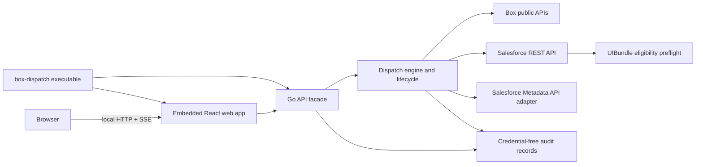
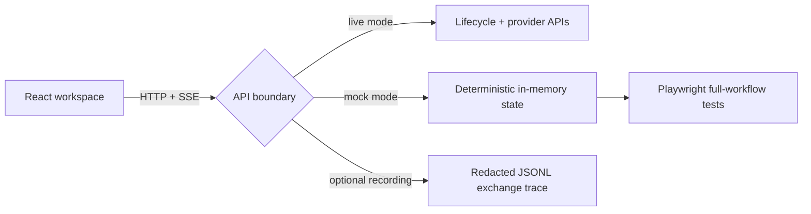

# Dispatch web application

Dispatch joins its embedded React interface and Go execution logic in one process.
The web application must not recreate provider logic in the browser.

The target is a local-first browser application. React owns presentation and temporary
form state; Go remains the sole authority for credentials, provider requests, package
assembly, validation, deployment, and audited teardown.



Frontend development has a provider-independent path that preserves the same
browser contract:



`box-dispatch mock` serves the embedded UI with in-memory connections, package
assembly, validation, deployment, deployment history, and server-sent progress
events. It never reads credentials or calls a provider. The live executable's
optional `--record-api` middleware captures the same browser-facing contract;
it redacts credential-shaped JSON fields and omits callback query strings.

## First vertical slice

- `web/` is a React 19 + Vite + TypeScript application using the published
  `@unofficialbox/box-open-elements` Web Components.
- The browser starts a new deployment by naming it, then choosing a configured quickstart
  and supported provider set. Go resolves the template source, builds the package, and saves the
  resulting BCL plan before the browser enters review, validation, and deployment.
  It also exposes an activity rail and audit history, falling back to non-sensitive
  demonstration state while the local API facade is unavailable.
- The normal executable serves the compiled React application and `/api` from one loopback
  process, then opens the browser. Vite proxies `/api` to `127.0.0.1:8787` only during
  frontend development; no token or client secret is available to browser code.

## Operator workflow

The browser workspace guides operators through:

1. Start from workspace defaults, name the deployment, and override its solution or provider set when needed.
2. Connect and verify Box and Salesforce.
3. Configure deployment strategy and supported components.
4. Validate provider state and deployment prerequisites.
5. Apply the validated deployment, open Box or Salesforce directly, and review the named audit result.

The browser is the only interactive user experience. The executable has no full-screen
terminal mode, prompts, keyboard-driven terminal navigation, or terminal presentation
dependencies.

## Security boundaries

- The browser receives no provider credentials or raw provider responses.
- The Go service remains loopback-only and returns `Cache-Control: no-store`.
- OAuth and token refresh are owned by the Go service; credentials never enter browser state.
- Connection selections, deployment plans, and workspace defaults are stored as owner-only BCL documents under `.dispatch/`.
- Deployment and cleanup operate on recorded immutable resource IDs.
- Unsupported or private provider APIs are excluded and tracked in [`PUBLIC_API_GAPS.md`](PUBLIC_API_GAPS.md).
- Generated solution packages use BCL as their portable contract; see [`../BCL_ARTIFACT_CONTRACT.md`](../BCL_ARTIFACT_CONTRACT.md).

## Current local API

Run the complete browser application and local API on the loopback interface:

```bash
go run ./cmd/box-dispatch
```

It is intentionally bound to `127.0.0.1:8787` and opens the app in the default browser. The API owns local state,
credentials, package assembly, validation, and deployment; the browser is a
credential-free presentation client. Salesforce connection starts with browser
OAuth login. Box login uses the same browser OAuth pattern with client
credentials from `.env`:

| Endpoint | Purpose | Deliberately excluded |
| --- | --- | --- |
| `GET /api/health` | active profile and server time | environment values |
| `GET /api/connections` | sanitized configured and verified connection state, including selected usernames and safe provider launch destinations | tokens, CCG secret, client ID, URL paths or queries |
| `GET /api/connections/salesforce/options` | safe list of locally connected Salesforce orgs, plus legacy CLI aliases during migration | tokens, instance URLs, and credentials |
| `PUT /api/connections/salesforce` | select one authenticated legacy Salesforce alias and require it to be revalidated | arbitrary targets, raw provider output, credentials |
| `PUT /api/connections/salesforce/rest` | save a target-org and/or Dev Hub REST connection in the owner-only local connection store | tokens, client secret, or raw credentials in the response |
| `POST /api/connections/salesforce/oauth/start` | start browser Salesforce login with Salesforce's public PlatformCLI client | PKCE verifier, consumer key, tokens |
| `GET /OauthRedirect` | Salesforce CLI-compatible redirect on port 1717; exchange the authorization code and store tokens locally | authorization codes, tokens, or secrets in HTML |
| `GET /api/connections/salesforce/oauth/callback` | same exchange as `/OauthRedirect`, kept for in-flight sessions | authorization codes, tokens, or secrets in HTML |
| `GET /api/connections/salesforce/oauth/{id}` | poll sanitized Salesforce login status | authorization codes, tokens, PKCE verifier |
| `POST /api/connections/salesforce/check` | verify that the selected Salesforce org is reachable with `/services/oauth2/userinfo`; refresh an expired access token when a refresh token is stored | access tokens and raw provider output |
| `POST /api/salesforce/scratch-orgs` | ask the configured Dev Hub to create a 30-day Developer scratch org, then optionally check and install required managed packages in the background | Dev Hub credentials and scratch-org access tokens |
| `GET /api/salesforce/scratch-orgs/latest` | restore the latest sanitized scratch-org and managed-package preparation status after a browser refresh | authorization codes, tokens, and raw provider responses |
| `GET /api/salesforce/scratch-orgs/{id}` | poll sanitized provisioning and package-install status until the new org is ready or failed | authorization codes, tokens, and raw provider responses |
| `PUT /api/connections/box` | verify a legacy Box CCG connection against the acting-user API, then add it to the local list and select it | CCG secret and all raw credential values |
| `PUT /api/connections/box/selection` | select one stored Box connection | CCG secrets, refresh tokens, and raw credential values |
| `DELETE /api/connections/box/{id}` | remove one stored Box connection by recorded ID | CCG secrets, refresh tokens, and raw credential values |
| `DELETE /api/connections/salesforce/{id}` | remove one stored Salesforce org by recorded ID | tokens and raw credential values |
| `POST /api/connections/box/oauth/start` | start browser Box login with `BOX_CLIENT_ID` / `BOX_CLIENT_SECRET` and `http://localhost:4400/oauth/callback` | client secret, PKCE verifier, tokens |
| `GET /oauth/callback` | Box redirect on port 4400; exchange the authorization code and store tokens locally | authorization codes, tokens, or secrets in HTML |
| `GET /api/connections/box/oauth/callback` | same exchange as `/oauth/callback`, kept for in-flight sessions | authorization codes, tokens, or secrets in HTML |
| `GET /api/connections/box/oauth/{id}` | poll sanitized Box login status | authorization codes, tokens, PKCE verifier |
| `POST /api/connections/box/check` | recheck the selected Box connection and refresh its verification snapshot | CCG secret, refresh token, access token |
| `GET /api/deployments` | durable deployment-run summaries | package path, artifact hashes, raw provider output |
| `GET /api/deployments/{id}` | a run's safe component counts | diagnostics, resources, source paths |
| `GET /api/plan` | saved BCL plan and selected-provider readiness | package path, credentials, provider identity |
| `PUT /api/plan` | save a supported template/provider draft to BCL | package path and all deployment execution |
| `GET /api/defaults` | owner-only workspace defaults used to initialize new deployments | credentials, readiness, and prior deployment identity |
| `PUT /api/defaults` | save the default solution, strategy, and supported provider set | deployment execution, connection selection, and arbitrary repositories |
| `GET /api/templates` | BCL-configured solution quickstarts and safe display copy | repository source URLs, local paths, credentials |
| `POST /api/packages` | assemble an allowlisted template into a server-chosen local workspace, then save its BCL plan | arbitrary repositories or destinations, package path, raw Git output |
| `GET /api/runs` | recent browser-run summaries, persisted across local API restarts | package paths, raw diagnostics, provider output |
| `POST /api/runs` | start a live validation run for the assembled package | raw diagnostics and provider credentials |
| `GET /api/runs/{id}` | read a validation or deployment run summary | raw provider detail |
| `GET /api/runs/{id}/changes` | preview text files that validation identified as additions or semantic updates | credentials, unchanged files, binary contents, oversized text |
| `GET /api/runs/{id}/diagnostics` | safe, actionable failure guidance plus sanitized provider detail | raw provider responses, credentials, local paths |
| `GET /api/runs/{id}/events` | follow provider and per-component activity over SSE | credentials and unsanitized provider responses |
| `POST /api/runs/{id}/deploy` | explicitly apply a completed validation run | implicit or unvalidated deployment |

Browser run history is saved under the operator's local Dispatch configuration
directory with owner-only permissions. A restarted server preserves browser-run
history, the validated plan, lifecycle items, and safe file previews; any
interrupted live run is explicitly marked as needing attention.
The browser restores the latest run for the saved deployment, returns an active
run to Deploy and a completed deployment to Summary, and requires a final
confirmation before `POST /api/runs/{id}/deploy` is sent.
Every response is `Cache-Control: no-store`. The server has no cross-origin
policy and must remain loopback-only. The plan writer accepts only Box and
Salesforce selections; future providers remain unavailable until Dispatch can
execute their public lifecycle safely.

The browser can save Salesforce target-org and Dev Hub credentials directly to
the loopback Go service. It can check the current org's availability and create
a replacement scratch org without exposing credentials to browser responses.
Scratch creation is an asynchronous REST workflow: Go creates `ScratchOrgInfo`
in the Dev Hub, polls it to an active or failed state, exchanges the returned
authorization code, saves the new target, and invalidates stale verification.
When managed-package preparation is selected, Dispatch checks installed package
versions before submitting an install, exposes the Salesforce request status to
the drawer, and prevents final deployment while that background work is active.
Previously saved CLI-derived aliases remain readable only as a migration fallback.

When target REST credentials are saved, the Salesforce lifecycle is API-native:
REST checks org availability and manages permission assignments; Tooling API
inventories and installs managed packages; Metadata API inventories source and
deploys the generated package. When the package contains `UIBundle` metadata,
validation reads the target org's instance and default language before component
comparison. It blocks first-party or non-English orgs with Hyperforce remediation,
and deployment repeats the preflight so skipped or stale validation cannot bypass it.
Packages without `UIBundle` metadata are unaffected. Validation uses `ListMetadata`
only to identify missing component names, retrieves every existing packaged component, and compares
normalized XML, JSON, bundle content, and source text against the package. Changed
components remain deployable even when their names already exist. Semantic XML comparison
recognizes Salesforce-owned read-back values for masked Auth Provider secrets and scratch-org
Network sender addresses without ignoring unrelated configuration drift. After deployment,
Dispatch retrieves the affected components again and refuses to report success until
the resulting Salesforce configuration matches. Validation emits a structured event
for every selected component as discovery and semantic comparison complete. After a
successful validation with drift, the browser offers an optional file-change review.
It loads the Box Open Elements diff viewer only when opened, presents one file at a
time in a split “Current org” / “Packaged change” comparison, and still lists binary
or files larger than 512 KB without sending their contents to the browser. The legacy Salesforce CLI adapter
is used only for stored configurations that have not migrated credentials; it is not an
interactive Dispatch user experience.

Template assembly is also browser-safe by construction: the request carries a
user-visible deployment name, template ID, and Box/Salesforce selections only. The local service looks up the
configured scenario, selects its repository, and creates an ignored workspace
under `.box-dispatch/web-packages/`; its absolute location and raw clone output
never cross the browser boundary.

## API progression

1. Lifecycle API: REST-native audited deployment reset by recorded resource ID,
   with an explicit confirmation endpoint.
2. Secret storage: move owner-only BCL credential values into the operating
   system keychain without changing the browser contract.

The browser is the sole interactive surface. Plain commands call the same Go services and
share the same BCL contracts without prompts, animated output, or terminal presentation state.
